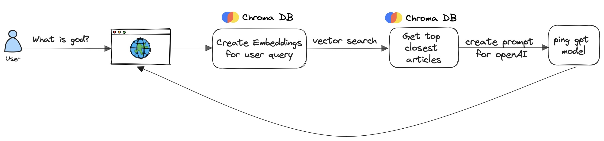

# ThinkAi

ThinkAi is a Python-based LLM App trained on philosophy research that can answer questions on philosophy using Chroma's Vector Search, HuggingFace tokenizers for text chunking, Meta's `bart-large-cnn` model for summarizing, and OpenAI's `gpt-3.5-turbo` model for structuring the final response. This is wrapped with a NextJS web app, code here - [ThinkAi UI](https://github.com/maanvithag/think-ai-ui)

### Basic User Flow:

