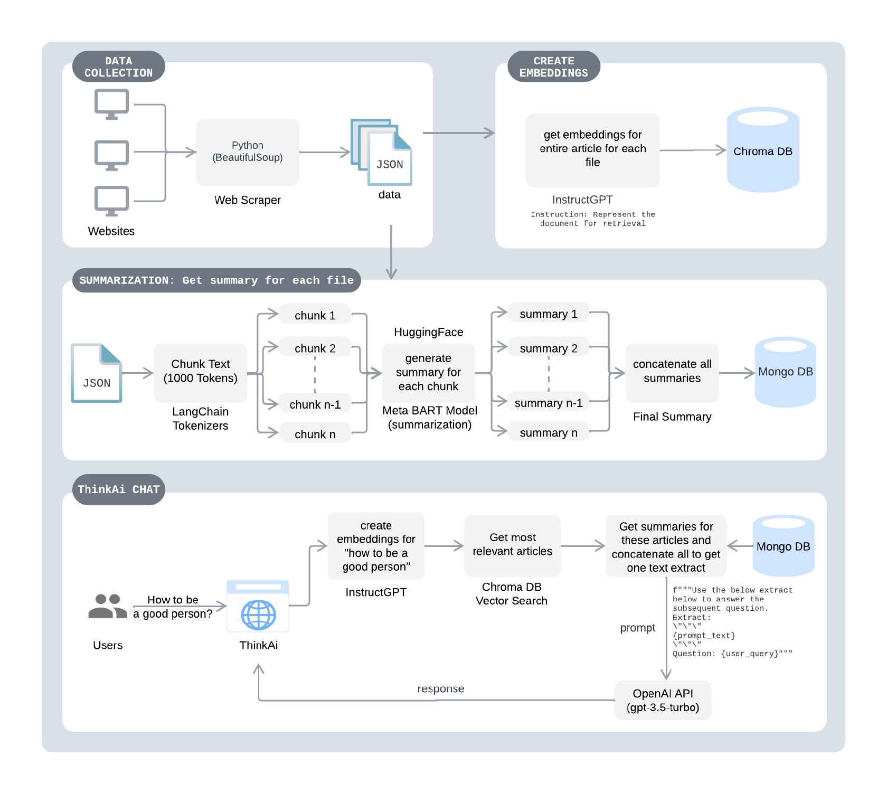
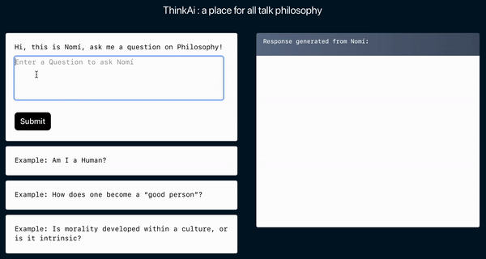
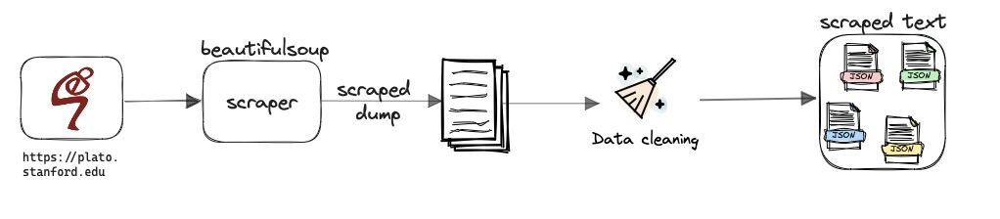
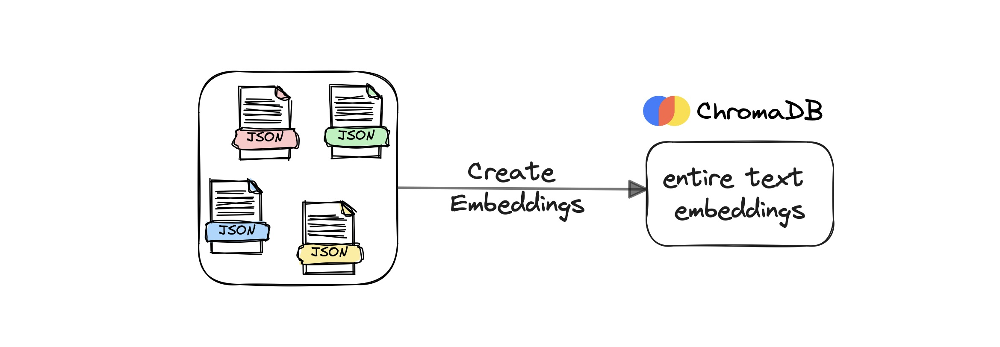
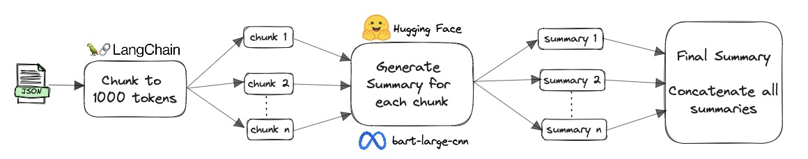

# ThinkAi

ThinkAi is an LLM app with [Retrieval Augmented Generation](https://ai.facebook.com/blog/retrieval-augmented-generation-streamlining-the-creation-of-intelligent-natural-language-processing-models/) (RAG) that talks Philosophy built using InstructGPT embeddings, Chroma's Vector Search, LangChain tokenizers for text chunking, Meta's `bart-large-cnn` model for summarizing, and OpenAI's `gpt-3.5-turbo` model for structuring the final response. This is wrapped with a NextJS web app hosted completely on AWS (AWS Amplify, AWS Elastic Beanstalk, and AWS EC2), code here - [ThinkAi UI](https://github.com/maanvithag/think-ai-ui)
 
LLMs are trained on the internet making it hard to know if the generated response comes from a reliable source or even if it is a product of its hallucination. RAG helps with adding external knowledge forcing the model to generate a response using this context. It enables more factual consistency, improves reliability of the generated responses, and helps to mitigate the problem of hallucination. This is exactly what ThinkAI aims to achieve.

Performance evaluation of ThinkAI with ChatGPT here: [ThinkAI v. ChatGPT](docs/thinkai_v_chatgpt.md)

# System Architecture:

 

## ThinkAI WebApp:
Try now for free: http://thinkai.live/
  

## Contents
1. [Basic User Flow](#user-flow)
2. [Data Collection](#data-collection)
3. [Create Embeddings](#create-embeddings)
4. [Summarize each article](#summarize)

## Basic User Flow: 
Here is how ThinkAi processes each user query;
* User queries the [web client](http://thinkai.live/).
* Chroma DB encodes this query using embeddings.
* The closest documents to this query are pulled using Chroma's vector search.
* The summaries for these documents are pulled from the preprocessed `JSON` file and concatenated serving as context to the prompt.
* API call prompting `gpt-3.5-turbo` and the response is sent back to the user.

Code for all the preprocessing step - COMING SOON!

## Preprocessing: Data Collection 
All the data has been collected from articles published and owned by [Stanford Encyclopedia of Philosphy](https://plato.stanford.edu). Using `beautifulsoup`, all scraped pages were dumped into files which were then cleaned removing noise like html tags, media, etc. and structured into `JSON` files.

## Preprocessing: Create Embeddings 
Using [Chroma DB](https://www.trychroma.com), embeddings are created on the entire text of each article with an index on the URL of each article. For a given query, Chroma creates embeddings and then using Vector search, Chroma pulls out the closest top 3 articles for the given query.

 

## Preprocessing: Summarize each article 
There are a lot of summarization models, however, the max token size is at 1024 tokens (~800 words) for summarizing any text. This does not fit the use case since the text here is at least a couple of pages long. One way to work through this is to chunk text, summarize individually, and combine again. This may result in loss of continuity in the flow of the text, to overcome that, we add few tokens overlap in each chunk so we stay with the flow. This has proven to extract the main context of the article. Each `JSON` file is broken into chunks of `1000 tokens` using [LangChain's Text Splitters](https://python.langchain.com/docs/modules/data_connection/document_transformers/). These chunks are individually summarized using [Meta's BART model](https://arxiv.org/abs/1910.13461) published on [HuggingFace](https://huggingface.co/facebook/bart-large-cnn). Finally, these individual summaries are combined together by simple concatenation.

All the generated summaries for each article is stored in a `JSON` file for fast access.